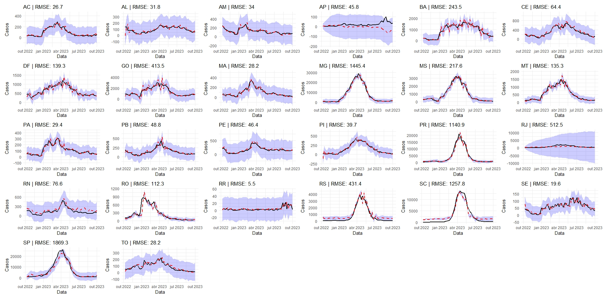
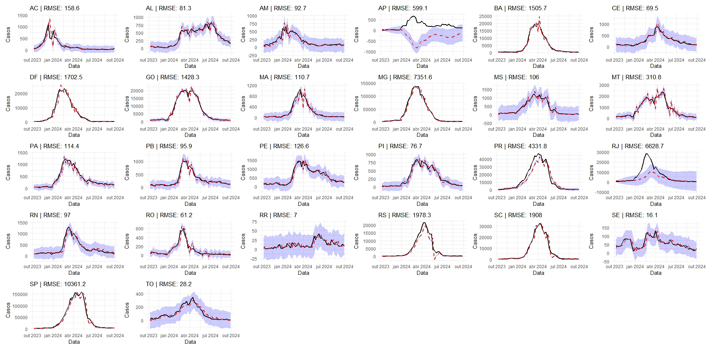
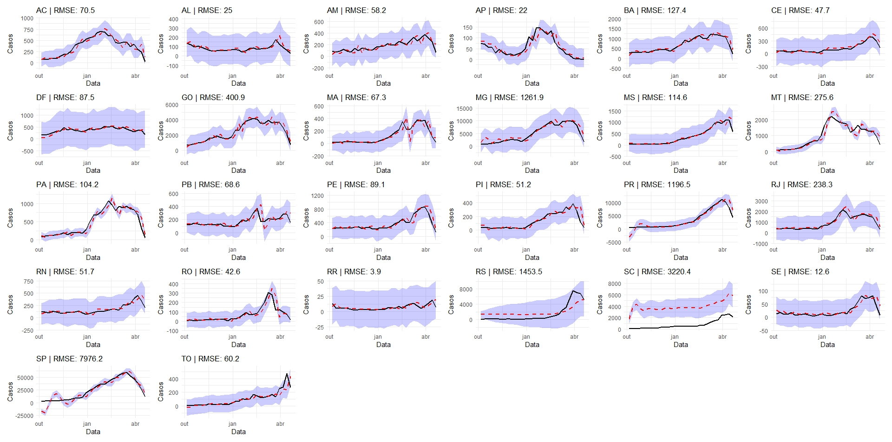

# 2025 Infodengue-Mosqlimate dengue Forecast Sprint

  

# Model Methodology

We used a ARIMAX model based on Xavier et al. (2015). As covariates, ee used lagged variables for the number of cases (1, 2, and 3 lags) and mean temperature (lag 1).

## Results

### Results for validation set 1

  

### Results for validation set 2

  

### Results for validation set 3

  

# Code Structure

The files `01_setup.R`, `02_download.R`, and `03_eda.R` are used for exploratory data analysis.

The code used for the model fit are located in the folder `resultados`. The predictions for the validation sets 1, 2, and 3 are in files `Thiago-Marcelo_treino1.R`, `Thiago-Marcelo_treino2.R`, and `Thiago-Marcelo_treino3.R`. 

Due to github limitation, 100MB are not supplied in this repository. Therefore, the `data` folder must be filled with the files `dengue.csv` and `climate.csv`, available at [https://sprint.mosqlimate.org/data/](https://sprint.mosqlimate.org/data/).

# References

Xavier, L. L., Pessanha, J. F. M., Honório, N. A., Ribeiro, M. S., Moreira, D. M., & Peiter, P. C. (2025). A incidência da dengue explicada por variáveis climáticas em municípios da Região Metropolitana do Rio de Janeiro. _Trends in Computational and Applied Mathematics_, 26, e01476. [https://doi.org/10.5540/tcam.2025.026.e01476](https://doi.org/10.5540/tcam.2025.026.e01476)